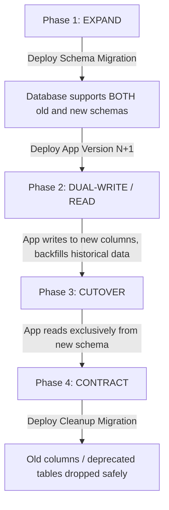

# Database Migration & Rollback Strategy

This document defines Airvix's database migration architecture, zero-downtime evolution patterns, versioning principles, tamper detection, and emergency rollback procedures.

---

## 1. Migration Architecture & Versioning

Airvix uses a programmatic, transactional migration engine located at [`backend/src/db/migrator.js`](file:///d:/SD/Agents/instAutoReplyDm/backend/src/db/migrator.js).

### Version Tracking Table: `schema_migrations`
Every migration run is recorded in the `schema_migrations` table with:
- **`version` (TEXT PRIMARY KEY)**: Numerical prefix matching the file name (e.g. `001`, `002`).
- **`name` (TEXT)**: Descriptive migration name (e.g. `001_initial_schema.js`).
- **`checksum` (TEXT)**: SHA-256 hash of the migration script content when applied.
- **`applied_at` (TEXT)**: Timestamp when the migration was executed.

```sql
CREATE TABLE IF NOT EXISTS schema_migrations (
  version TEXT PRIMARY KEY,
  name TEXT NOT NULL,
  checksum TEXT NOT NULL,
  applied_at TEXT DEFAULT to_char(NOW(), 'YYYY-MM-DD HH24:MI:SS')
);
```

### Checksum Tamper Detection
Before applying or checking migrations, `migrator.js` recomputes the SHA-256 hash of each existing file on disk and compares it against `schema_migrations.checksum`. If a previously applied migration file has been modified in git or in transit, the migrator logs a security warning to prevent unexpected schema drift.

---

## 2. CLI Usage & Operations

All migration commands are executed through `node backend/src/db/migrator.js <command>`:

| Command | Description |
|---|---|
| `node backend/src/db/migrator.js status` | Lists all migrations, their status (`APPLIED` / `PENDING`), applied timestamps, and checksums. |
| `node backend/src/db/migrator.js up` | Executes all pending migrations forward in numerical order inside database transactions. |
| `node backend/src/db/migrator.js down` | Rolls back the single most recently applied migration by executing its `down()` function. |
| `node backend/src/db/migrator.js down 2` | Rolls back the last 2 applied migrations in reverse numerical order. |

---

## 3. Zero-Downtime Production Migration Strategy: Expand / Contract

In production, Airvix follows the **Expand / Contract (Parallel Run)** pattern to guarantee zero downtime and 100% backward compatibility during continuous deployments:



### Rules for Backward-Compatible Schema Changes

1. **Adding Columns**:
   - **Rule**: Never add a `NOT NULL` column without a `DEFAULT` value to an existing table.
   - **Pattern**:
     ```sql
     -- CORRECT: Safe for running applications
     ALTER TABLE users ADD COLUMN IF NOT EXISTS mfa_enabled INTEGER DEFAULT 0;
     ```
2. **Renaming Columns**:
   - **Rule**: Never use `ALTER TABLE table RENAME COLUMN old_name TO new_name;` directly in production. This breaks running app instances that still query `old_name`.
   - **4-Phase Lifecycle**:
     - *Phase 1 (Expand)*: Add `new_name` with `NULL` or default.
     - *Phase 2 (Dual Write)*: Application writes to both `old_name` and `new_name`.
     - *Phase 3 (Backfill & Read)*: Backfill historical rows from `old_name` into `new_name`. Switch application queries to read `new_name`.
     - *Phase 4 (Contract)*: Remove code references to `old_name`. Run a migration to drop `old_name`.
3. **Dropping Tables / Columns**:
   - Only drop a column or table in a subsequent deployment **after** verifying that no running container or background worker references it.
4. **Index Creation**:
   - Use `CREATE INDEX IF NOT EXISTS` to ensure idempotent re-runs without errors.

---

## 4. Rollback Strategy & Safety Invariants

### Reversible `down()` Handlers
Every migration in `backend/src/db/migrations/` **must** export an asynchronous `down(client)` function:

```javascript
module.exports = {
  async up(client) {
    await client.query(`CREATE TABLE IF NOT EXISTS example (...);`);
  },
  async down(client) {
    await client.query(`DROP TABLE IF EXISTS example CASCADE;`);
  }
};
```

### Rollback Guidelines
- **Staging / CI Verification**: All migrations must be tested for reversible rollback (`up` -> `down` -> `up`) in staging and automated test suites before being merged to `main`.
- **Destructive Rollback Warning**: In production, rolling back a migration that drops a table will result in data loss for rows written after the migration. If unexpected errors occur post-deploy:
  1. Assess whether a forward fix patch can resolve the issue within RTO (< 15 mins).
  2. If rollback is necessary, run `node backend/src/db/migrator.js down` immediately before active user data accumulates in newly migrated columns.
  3. Re-deploy the previous stable Docker image or git commit.

---

## 5. Migration Directory Registry

| Version | File | Responsibility |
|---|---|---|
| `001` | [`001_initial_schema.js`](file:///d:/SD/Agents/instAutoReplyDm/backend/src/db/migrations/001_initial_schema.js) | Core multi-tenant tables (`users`, `instagram_accounts`, `automation_rules`, `conversations`, `messages`, `activity_log`, `workspaces`, `audit_logs`). |
| `002` | [`002_webhook_reliability_dlq.js`](file:///d:/SD/Agents/instAutoReplyDm/backend/src/db/migrations/002_webhook_reliability_dlq.js) | Webhook idempotency tracking (`webhook_events`) and resilient Dead-Letter Queue (`dead_letter_queue`). |
| `003` | [`003_saas_billing_subscriptions.js`](file:///d:/SD/Agents/instAutoReplyDm/backend/src/db/migrations/003_saas_billing_subscriptions.js) | SaaS monetization (`subscriptions`, `invoices`, `payment_webhook_events`). |
| `004` | [`004_admin_security_mfa_sessions.js`](file:///d:/SD/Agents/instAutoReplyDm/backend/src/db/migrations/004_admin_security_mfa_sessions.js) | Admin 2FA/MFA encryption keys and session revocation tracking (`admin_sessions`). |
| `005` | [`005_observability_telemetry.js`](file:///d:/SD/Agents/instAutoReplyDm/backend/src/db/migrations/005_observability_telemetry.js) | System telemetry, deduplicated error logging (`error_events`), system alerts, data deletion compliance, and loop incident tracking. |
