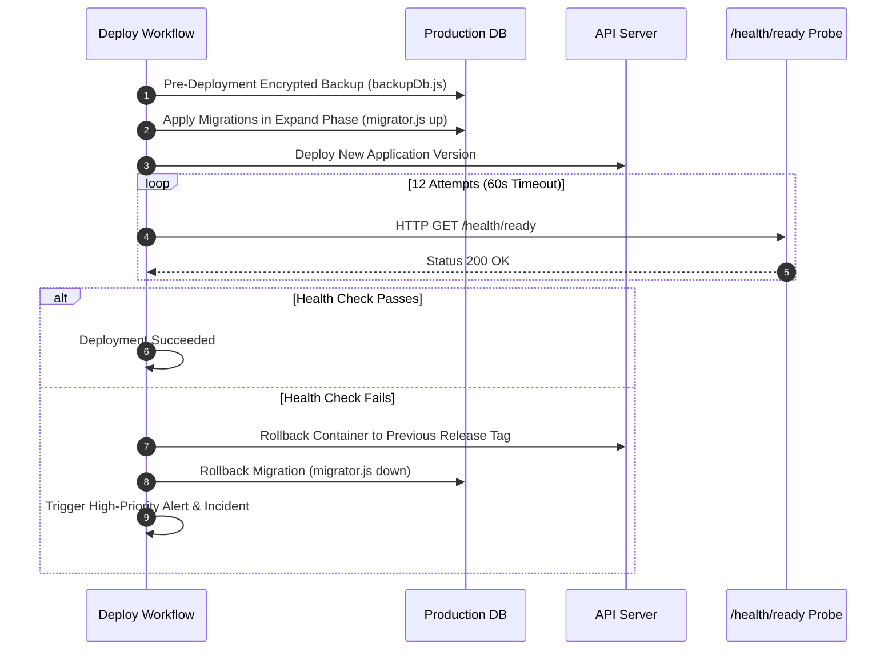

# Deployment Security, Environment Isolation & CI/CD Architecture

This document specifies the deployment security standards, environment isolation boundaries, secret protection policies, and automated rollback workflows for Airvix.

---

## 1. Environment Isolation Architecture

Airvix enforces strict physical and logical boundaries across three deployment tiers: **Development**, **Staging**, and **Production**.

```mermaid
graph TD
  subgraph Local / Development
    DevApp[Developer Machines]
    DevDb[(Local DB / Neon Dev Branch)]
    DevMeta[Meta Sandbox App / Test Users]
  end

  subgraph Staging Tier
    StagingCI[GitHub Actions CI/CD]
    StagingApp[Staging API Cluster]
    StagingDb[(Neon Staging Branch)]
    StagingMeta[Meta Development App]
  end

  subgraph Production Tier (Strict Boundary)
    ProdCI[Protected CD Workflow]
    ProdApp[Production API Cluster]
    ProdDb[(Neon Production Primary DB)]
    ProdMeta[Meta Live / Reviewed App]
  end

  DevApp -.->|PR to Develop/Staging| StagingCI
  StagingCI -->|Automated Verification| StagingApp
  StagingApp -.->|PR to Main + Approvals| ProdCI
  ProdCI -->|Automated Expand Migration + Release| ProdApp
```

### Isolation Matrix

| Dimension | Development | Staging | Production |
|---|---|---|---|
| **Database** | Local SQLite / Neon Dev branch | Dedicated Neon Staging branch | Neon Dedicated Primary with High Availability |
| **Meta App** | Meta Sandbox / Test Accounts | Development App ID | Verified Production App ID with Meta App Review permissions |
| **Encryption Keys** | Local development keys | High-entropy Staging Secret | Cryptographically isolated 32-byte HSM/KMS keys |
| **Webhook Endpoint** | ngrok / local tunnel | `https://staging-api.airvix.ai/api/webhook` | `https://api.airvix.ai/api/webhook` |
| **User Data** | Synthetic mock accounts only | Anonymized test fixtures | Encrypted real tenant & Instagram customer data |

---

## 2. Secrets Management & Zero-Trust Invariants

1. **Zero Secret Check-in**:
   - Secrets are **never** committed to version control.
   - All `.env*` files (except `.env.example`) are in `.gitignore`.
   - Continuous scanning is enforced via Gitleaks in CI on every push and pull request.
2. **Key Separation**:
   - `TOKEN_ENCRYPTION_KEY`: 32-byte hex key for user Instagram OAuth and Meta tokens (AES-256-GCM).
   - `BACKUP_ENCRYPTION_KEY`: Independent 32-byte key specifically for database backup archives.
   - `JWT_SECRET`: High-entropy signing secret for admin and user access tokens.
3. **Secret Rotation Procedure**:
   - Generate a new 32-byte key: `node -e "console.log(require('crypto').randomBytes(32).toString('hex'))"`.
   - Update staging environment variables and verify service health before updating production secrets.
   - Maintain historical key support during transition periods to decrypt existing database values seamlessly.

---

## 3. Automated CI Gates & Verification

Every pull request and push to protected branches must pass the automated GitHub Actions pipeline (`.github/workflows/ci.yml`):

1. **Secret Scanning**:
   - Executes `gitleaks-action` across full git commit history to block committed tokens, passwords, or keys.
2. **Dependency Vulnerability Scanning**:
   - Runs `npm audit --audit-level=high` on both the backend root and the frontend Vite project.
   - Fails the build immediately if high or critical CVEs are detected.
3. **Automated Test Gates (77+ Automated Invariants)**:
   - Multi-tenant data isolation & IDOR tests ([`tests/multiTenantSecurity.test.js`](file:///d:/SD/Agents/instAutoReplyDm/tests/multiTenantSecurity.test.js)).
   - Webhook idempotency, replay protection, and DLQ dispatch ([`tests/webhookReliability.test.js`](file:///d:/SD/Agents/instAutoReplyDm/tests/webhookReliability.test.js)).
   - SaaS subscription tiers, plan limits, and payment validation ([`tests/billingAndSubscription.test.js`](file:///d:/SD/Agents/instAutoReplyDm/tests/billingAndSubscription.test.js)).
   - Admin RBAC, MFA verification, and session revocation ([`tests/adminSecurity.test.js`](file:///d:/SD/Agents/instAutoReplyDm/tests/adminSecurity.test.js)).
   - Observability, telemetry, and health probe checks ([`tests/observability.test.js`](file:///d:/SD/Agents/instAutoReplyDm/tests/observability.test.js)).
   - Database migration integrity and rollback execution ([`tests/migrator.test.js`](file:///d:/SD/Agents/instAutoReplyDm/tests/migrator.test.js)).
   - Backup creation, encryption, and restore verification ([`tests/backupRecovery.test.js`](file:///d:/SD/Agents/instAutoReplyDm/tests/backupRecovery.test.js)).
4. **Frontend Build Check**:
   - Compiles the React + Vite frontend application to ensure zero syntax or bundling errors.

---

## 4. Deployment Verification & Auto-Rollback Protocol

The continuous deployment workflow (`.github/workflows/deploy.yml`) follows a rigorous safety-first sequence:



### Readiness Probe Details (`/health/ready`)
The deployment gate polls the `/health/ready` endpoint, which verifies:
- Database connectivity and connection pool status.
- Redis / Queue connectivity (or circuit-breaker fallback readiness).
- Memory headroom and event loop responsiveness.

If the endpoint does not return HTTP 200 within 60 seconds (12 polling attempts with 5-second intervals), the pipeline automatically triggers the rollback step.

---

## 5. Branch Protection Rules

To guarantee deployment integrity:
- `main` branch requires at least 1 approved pull request review.
- All CI status checks (`Secret & Token Leak Detection`, `Dependency Security Scanning`, `Automated Test Verification Gates`, `Frontend Build & Compilation Check`) must be green.
- Direct pushes to `main` are disallowed.
